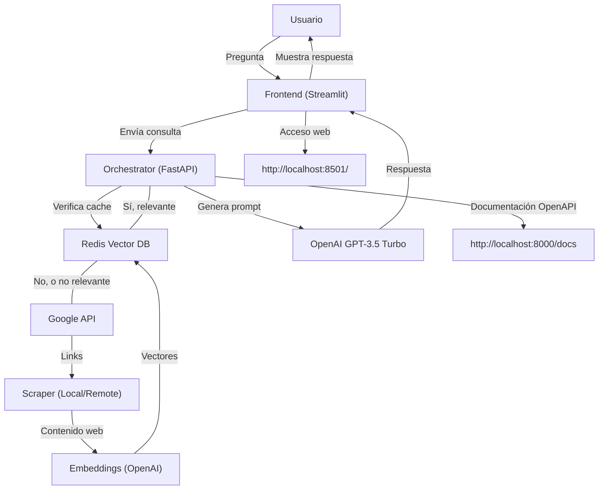
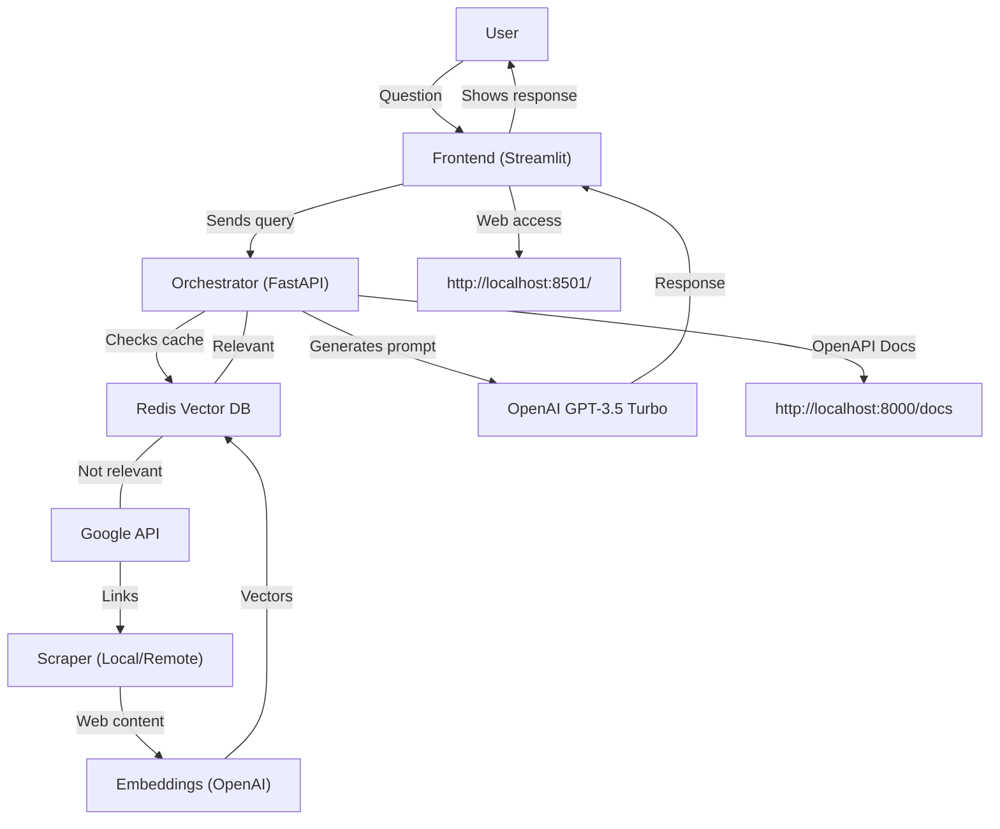
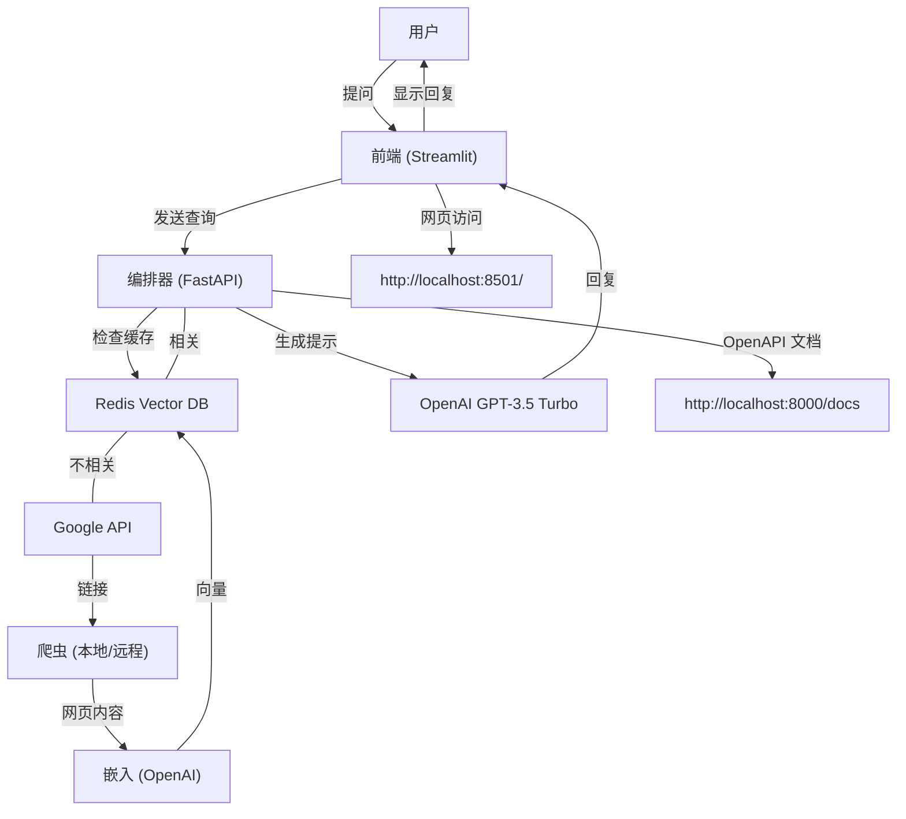
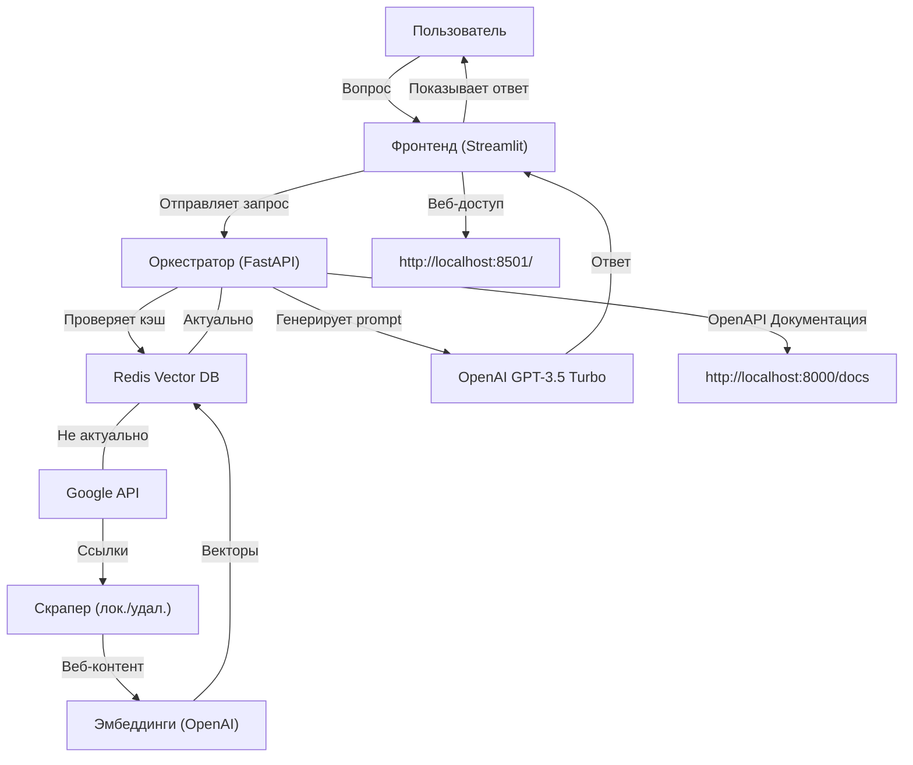

# InternetWhisper

---

## Español

### Descripción del Proyecto
InternetWhisper es un chatbot conversacional de IA generativa, inspirado en You.com y Bard de Google, capaz de acceder a Internet en tiempo real para responder preguntas y mantener conversaciones. Utiliza una base de datos vectorial Redis para cachear información y la API de búsqueda de Google para obtener datos actualizados, integrando modelos de OpenAI para generar respuestas naturales y precisas.

### Explicación Técnica
- **Frontend:** Streamlit (interfaz web)
- **Orchestrator:** FastAPI (API principal, lógica de negocio, integración IA)
- **Cache:** Redis Vector DB (almacenamiento de embeddings y contexto)
- **Scraper:** aiohttp (local) o Playwright (remoto, para JS)
- **Embeddings:** OpenAI (por defecto) o remoto
- **Búsqueda:** Google Custom Search API
- **Contenedores:** Docker Compose para orquestar todos los servicios

#### Diagrama de Flujo


### Variables de Entorno
Cree un archivo `.env` con:
- `HEADER_ACCEPT_ENCODING`: "gzip"
- `HEADER_USER_AGENT`: Cadena de agente de usuario (ejemplo en la documentación)
- `GOOGLE_API_HOST`: "https://www.googleapis.com/customsearch/v1?"
- `GOOGLE_FIELDS`: Campos a recuperar de Google
- `GOOGLE_API_KEY`: Clave de Google Custom Search
- `GOOGLE_CX`: ID de motor de búsqueda personalizado
- `OPENAI_API_KEY`: Clave de OpenAI

### Instalación y Ejecución Local
1. Clonar el repositorio y entrar al directorio del proyecto.
2. Crear el archivo `.env`.
3. Construir y levantar los servicios:
   ```bash
   docker-compose build
   docker-compose up
   ```
4. Acceder a la app en [http://localhost:8501/](http://localhost:8501/)

### Documentación OpenAPI
La API principal expone documentación OpenAPI en [http://localhost:8000/docs](http://localhost:8000/docs)

---

## English

### Project Description
InternetWhisper is a generative AI conversational chatbot, inspired by You.com and Google Bard, capable of accessing the Internet in real time to answer questions and hold conversations. It uses a Redis vector database for caching information and the Google Search API for up-to-date data, integrating OpenAI models to generate natural and accurate responses.

### Technical Explanation
- **Frontend:** Streamlit (web interface)
- **Orchestrator:** FastAPI (main API, business logic, AI integration)
- **Cache:** Redis Vector DB (embeddings/context storage)
- **Scraper:** aiohttp (local) or Playwright (remote, for JS)
- **Embeddings:** OpenAI (default) or remote
- **Search:** Google Custom Search API
- **Containers:** Docker Compose orchestrates all services

#### Flow Diagram


### Environment Variables
Create a `.env` file with:
- `HEADER_ACCEPT_ENCODING`: "gzip"
- `HEADER_USER_AGENT`: User agent string (see docs)
- `GOOGLE_API_HOST`: "https://www.googleapis.com/customsearch/v1?"
- `GOOGLE_FIELDS`: Fields to retrieve from Google
- `GOOGLE_API_KEY`: Google Custom Search key
- `GOOGLE_CX`: Custom search engine ID
- `OPENAI_API_KEY`: OpenAI key

### Local Installation & Run
1. Clone the repo and enter the project directory.
2. Create the `.env` file.
3. Build and start the services:
   ```bash
   docker-compose build
   docker-compose up
   ```
4. Access the app at [http://localhost:8501/](http://localhost:8501/)

### OpenAPI Documentation
The main API exposes OpenAPI docs at [http://localhost:8000/docs](http://localhost:8000/docs)

---

## 中文 (Chinese)

### 项目简介
InternetWhisper 是一个生成式 AI 聊天机器人，灵感来自 You.com 和 Google Bard，能够实时访问互联网以回答问题和进行对话。它使用 Redis 向量数据库缓存信息，并通过 Google 搜索 API 获取最新数据，集成 OpenAI 模型生成自然、准确的回复。

### 技术说明
- **前端：** Streamlit（网页界面）
- **编排器：** FastAPI（主 API，业务逻辑，AI 集成）
- **缓存：** Redis Vector DB（嵌入/上下文存储）
- **爬虫：** aiohttp（本地）或 Playwright（远程，支持 JS）
- **嵌入：** OpenAI（默认）或远程
- **搜索：** Google Custom Search API
- **容器：** Docker Compose 管理所有服务

#### 流程图


### 环境变量
创建 `.env` 文件，内容包括：
- `HEADER_ACCEPT_ENCODING`: "gzip"
- `HEADER_USER_AGENT`: 用户代理字符串（见文档）
- `GOOGLE_API_HOST`: "https://www.googleapis.com/customsearch/v1?"
- `GOOGLE_FIELDS`: 需从 Google 获取的字段
- `GOOGLE_API_KEY`: Google Custom Search 密钥
- `GOOGLE_CX`: 自定义搜索引擎 ID
- `OPENAI_API_KEY`: OpenAI 密钥

### 本地安装与运行
1. 克隆仓库并进入项目目录。
2. 创建 `.env` 文件。
3. 构建并启动服务：
   ```bash
   docker-compose build
   docker-compose up
   ```
4. 访问 [http://localhost:8501/](http://localhost:8501/)

### OpenAPI 文档
主 API 的 OpenAPI 文档位于 [http://localhost:8000/docs](http://localhost:8000/docs)

---

## Русский (Russian)

### Описание проекта
InternetWhisper — это генеративный чат-бот с искусственным интеллектом, вдохновленный You.com и Google Bard, способный в реальном времени обращаться к Интернету для ответов на вопросы и ведения диалогов. Использует векторную базу данных Redis для кэширования информации и Google Search API для получения актуальных данных, интегрируя модели OpenAI для генерации естественных и точных ответов.

### Техническое описание
- **Фронтенд:** Streamlit (веб-интерфейс)
- **Оркестратор:** FastAPI (основной API, бизнес-логика, интеграция ИИ)
- **Кэш:** Redis Vector DB (хранение эмбеддингов/контекста)
- **Скрапер:** aiohttp (локальный) или Playwright (удалённый, для JS)
- **Эмбеддинги:** OpenAI (по умолчанию) или удалённые
- **Поиск:** Google Custom Search API
- **Контейнеры:** Docker Compose для управления всеми сервисами

#### Диаграмма потока


### Переменные окружения
Создайте файл `.env` со следующими переменными:
- `HEADER_ACCEPT_ENCODING`: "gzip"
- `HEADER_USER_AGENT`: строка user agent (см. документацию)
- `GOOGLE_API_HOST`: "https://www.googleapis.com/customsearch/v1?"
- `GOOGLE_FIELDS`: поля для получения из Google
- `GOOGLE_API_KEY`: ключ Google Custom Search
- `GOOGLE_CX`: ID пользовательской поисковой системы
- `OPENAI_API_KEY`: ключ OpenAI

### Установка и запуск локально
1. Клонируйте репозиторий и перейдите в папку проекта.
2. Создайте файл `.env`.
3. Соберите и запустите сервисы:
   ```bash
   docker-compose build
   docker-compose up
   ```
4. Откройте [http://localhost:8501/](http://localhost:8501/)

### Документация OpenAPI
Основной API предоставляет OpenAPI-документацию по адресу [http://localhost:8000/docs](http://localhost:8000/docs)

--- 